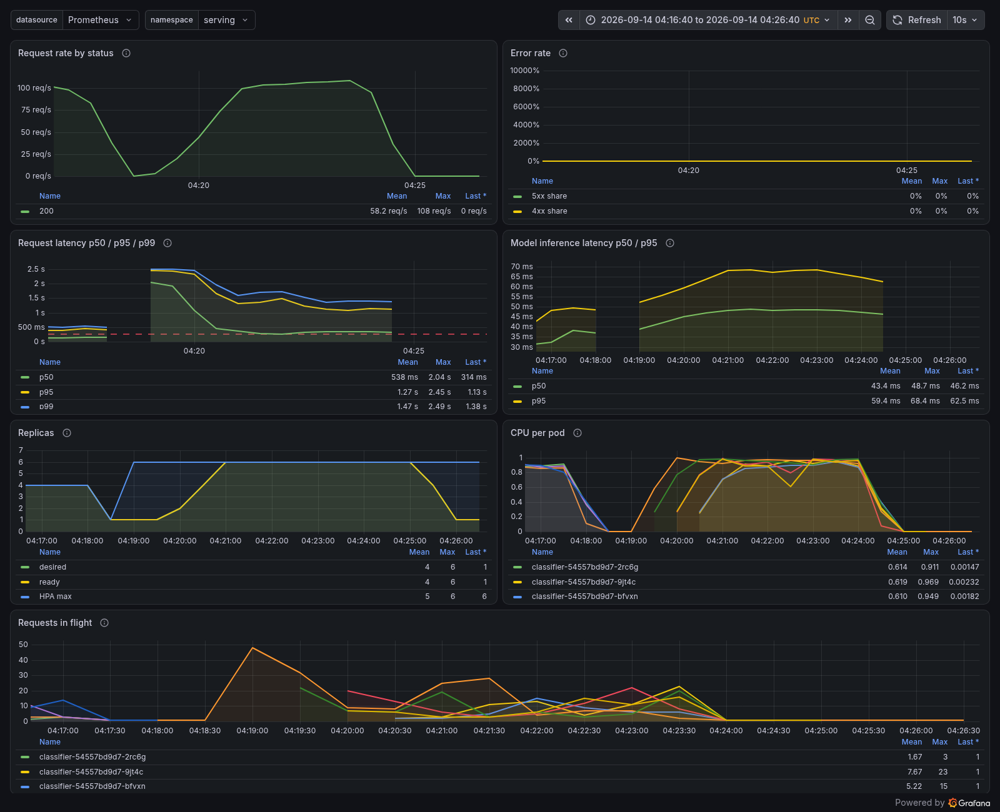

# onnx-deployment

This project takes a small PyTorch convolutional classifier, exports it to the
ONNX format, and runs the exported graph with onnxruntime. The point is to show
that the deployed graph produces the same numbers as the original PyTorch model,
which is the property you actually care about when you move a model out of a
training framework and into a runtime.

## Why this matters

Training happens in PyTorch, but serving often happens somewhere else. ONNX is a
portable graph format that many runtimes can load, and onnxruntime is a fast CPU
and GPU engine for those graphs. The risk in any export step is silent numeric
drift: the graph loads, it runs, it returns plausible looking logits, and yet
the values have quietly diverged from the trained model. The tests here close
that gap by comparing the two side by side on random input and asserting the
maximum absolute difference stays below 1e-4.

## Layout

```
serve/
  app.py        FastAPI inference service with readiness, liveness, stats and Prometheus metrics endpoints
  loadtest.py   in cluster correctness check and closed loop load generator
  Dockerfile    non root serving image with the model baked in
infra/
  terraform/                     kind cluster, classifier, HPA, PDB, metrics-server and kube-prometheus-stack in one apply
  terraform/charts/classifier-monitoring   ServiceMonitor and PrometheusRule for the classifier
  grafana/classifier-dashboard.json        dashboard loaded by the Grafana sidecar
  run_monitoring_experiments.py            Prometheus vs load test p95, alert firing, dashboard query export
k8s/
  deployment.yaml      Deployment, Service and PodDisruptionBudget
  hpa.yaml             HorizontalPodAutoscaler on CPU
  kind-config.yaml     local cluster with the test data mounted
  run_experiments.sh   every measurement in k8s/results
  results/             raw measurements
src/
  model.py    the SmallCNN architecture
  export.py   ONNX export plus torch and onnxruntime forward passes
  cli.py      command line entry point
tests/
  test_parity.py   behavior and parity tests
  test_serve.py    service probes, predictions, bad input, the client side resize identity, and /metrics
```

## The model

`SmallCNN` is a compact two block network. Each block is a 3x3 convolution
followed by a ReLU and a 2x2 max pool, so the spatial size is quartered before a
single linear head maps the flattened features to class logits. It takes single
channel square images by default and works on CPU in well under a second, which
keeps the tests fast and free of any dataset download. The channel count, class
count, and image size are all configurable.

## Install

```
pip install -r requirements.txt
```

## Export and verify

```
python -m src.cli export --output model.onnx
```

This builds the model, writes `model.onnx` with a dynamic batch axis, validates
the graph with the ONNX checker, then runs both the PyTorch model and the
onnxruntime session on the same random batch. It prints the maximum absolute
difference and reports whether parity holds within the tolerance. The command
exits non zero if the difference exceeds the tolerance, so it works as a gate in
a deployment pipeline.

## Run inference with the exported graph

```
python -m src.cli run --model model.onnx --batch 5
```

This loads the ONNX file in onnxruntime, feeds a random batch through it, and
prints the output shape and the predicted class per row. Because the export
declares a dynamic batch axis, any batch size loads against the same graph.

## Serving it on Kubernetes

`serve/` and `k8s/` take a real exported model all the way to a load balanced, autoscaled service,
and measure it. The model is the ResNet50 chest X-ray classifier from the
[tensorrt-optimization](https://github.com/SharvenRane/tensorrt-optimization) benchmark (NLM
Montgomery tuberculosis set), exported to a single 94 MB ONNX file and served with ONNX Runtime on
CPU.

**The service** (`serve/app.py`, FastAPI) takes a PNG, applies exactly the torchvision eval
transform the model was trained with, and returns probabilities, logits and the pod that answered.
`/readyz` only reports ready after the model has loaded and run a warm up inference, so no pod
receives traffic cold. The image runs as a non root user with the model baked in.

**The cluster** is a local kind cluster. The Deployment gives each pod exactly 1 CPU and one ONNX
Runtime thread, with startup, readiness and liveness probes, a rolling update that never drops
below the current replica count (`maxUnavailable: 0`), a `preStop` delay so endpoint removal
propagates before a pod stops, and a PodDisruptionBudget. A HorizontalPodAutoscaler targets 60% CPU
between 1 and 6 replicas. Load comes from `serve/loadtest.py` running as a Job inside the cluster,
so requests go through cluster DNS and kube-proxy like any in cluster client. It opens a fresh
connection per request, so the Service balances per request rather than pinning a worker to a pod.

### Results

**Correctness through the whole stack.** All 42 test radiographs were sent at full resolution through the
Service: accuracy 0.8571, the same prediction as PyTorch on CPU for 42 of 42, and a maximum logit
difference of 4.8e-05.

**Scaling with replicas** (16 concurrent clients, 45 s each, 0 failed requests in every run):

| replicas | throughput | p50 latency | p95 latency | speedup |
|---|---|---|---|---|
| 1 | 33.0 rps | 477 ms | 522 ms | 1.00x |
| 2 | 61.7 rps | 254 ms | 481 ms | 1.87x |
| 4 | 105.7 rps | 124 ms | 347 ms | 3.20x |
| 8 | 174.5 rps | 75 ms | 207 ms | 5.29x |

Requests spread evenly: at 8 replicas each pod served between 937 and 1,011 requests.

**Autoscaling from one idle pod under sustained load** (240 s, 26,947 requests, 0 failed). The
HPA started from a single settled pod at 0% CPU and scaled 1 to 2 replicas 47 s after the load Job
was submitted, to 4 at 78 s, and to its ceiling of 6 at 120 s, adding at most 2 pods per 15 s as
configured. The load generator's own 10 s windows show the same staircase (the one window that straddles
the step from 2 to 4 pods, 98.1 rps, is left out):

| load phase | throughput (10 s windows) | p95 latency |
|---|---|---|
| first 40 s | 33.7 to 34.3 rps | 477 to 494 ms |
| next 30 s | 61.0 to 64.3 rps | 450 to 466 ms |
| next 40 s | 111.7 to 124.6 rps | 301 to 362 ms |
| remaining 120 s | 138.3 to 159.4 rps | 223 to 322 ms |

**Rolling restart under load** (4 replicas, 16 concurrent clients, 90 s): every pod was replaced
in 12 s while 10,228 requests ran, with **0 failed requests**. Throughput stayed between 110.5 and
118.9 rps in every full 10 s window, and p95 rose from about 310 ms to 384 ms in the window where pods
were swapped.

Raw measurements, including the per 10 s windows and the HPA timeline, are in `k8s/results/`.

### What the numbers say

**Replicas buy throughput almost linearly up to 4, then less.** 1.87x at 2 and 3.20x at 4 replicas,
but 5.29x at 8. The load generator is a single Python process and the node shares 24 CPUs with
the pods, so the flattening at 8 is not attributed to the service itself; separating those would
need the load generated from another machine.

**Latency is queueing, not compute.** One replica runs one inference at a time, about 29 ms of
model time, so with 16 concurrent clients a single pod's p50 is 477 ms of waiting. Adding replicas
cuts that queue, which is why p50 falls roughly in proportion.

**Zero downtime needed three settings working together:** a readiness probe that waits for a real
inference, `maxUnavailable: 0`, and a `preStop` delay. The rollout test is what shows they do.

### Reproduce

```bash
python -m pip install onnx
python -c "import onnx; onnx.save_model(onnx.load('resnet50_montgomery.onnx'), 'models/model.onnx', save_as_external_data=False)"
docker build -f serve/Dockerfile -t classifier:local .
kind create cluster --name ml --config k8s/kind-config.yaml
kind load docker-image classifier:local --name ml
kubectl apply -f https://github.com/kubernetes-sigs/metrics-server/releases/latest/download/components.yaml
kubectl -n kube-system patch deployment metrics-server --type=json   -p='[{"op":"add","path":"/spec/template/spec/containers/0/args/-","value":"--kubelet-insecure-tls"}]'
kubectl apply -f k8s/deployment.yaml
bash k8s/run_experiments.sh
```

Measured on a Ryzen 9 9900X under WSL2 (24 vCPUs visible to the kind node), kind v0.34, Kubernetes
client 1.37, ONNX Runtime 1.30. Every run is one run; the numbers are indicative of shape, not a
capacity guarantee for other hardware. These results were measured before the service gained
Prometheus metrics, when inference still ran on the event loop.

## Infrastructure as code and monitoring

`infra/terraform` builds the whole stack from nothing with one `terraform apply`: the kind cluster
([tehcyx/kind](https://registry.terraform.io/providers/tehcyx/kind) provider), then through the
`kubernetes` and `helm` providers configured from that cluster's credentials, the classifier
Deployment, Service, HPA and PodDisruptionBudget, `metrics-server`, and `kube-prometheus-stack`
(Prometheus, Alertmanager, Grafana with its image renderer, `kube-state-metrics`). Replicas, HPA bounds,
resources, image, alert thresholds and chart versions are variables.

Two design points worth knowing:

- The ServiceMonitor and PrometheusRule are custom resources, so they ship as a small local Helm chart
  (`charts/classifier-monitoring`) that depends on the stack release. A `kubernetes_manifest` would
  need the CRDs to exist at plan time, which breaks a single apply from an empty cluster.
- The Grafana dashboard is plain JSON in `infra/grafana/`, put into a ConfigMap labelled
  `grafana_dashboard` that the Grafana sidecar loads. Its panels: request rate by status, 5xx and 4xx
  share, p50, p95 and p99 request latency from the histogram with the alert threshold drawn in, model
  inference latency, replicas (desired, ready, HPA max), CPU per pod, and requests in flight.

### Service metrics

`/metrics` exposes `classifier_http_requests_total{handler,method,status}`,
`classifier_http_request_duration_seconds{handler}` (histogram), `classifier_model_inference_seconds`
(histogram), `classifier_http_requests_in_flight` and `classifier_model_ready`. Unknown paths share
the label `handler="other"` so a scanner cannot blow up label cardinality.

**Where the timer starts decides whether the histogram tells the truth.** The first version timed
requests in middleware while inference still ran on the event loop. A request only reaches the
middleware once the loop is free, so the queue in front of the single inference slot was invisible.
Measured on the host with one process and 16 clients for 20 s (`k8s/results/timer_placement_local.json`):

| inference runs on | client p95 | p95 from the histogram |
|---|---|---|
| the event loop | 513 ms | 49 ms |
| one worker thread | 543 ms | 547 ms |

The service now decodes and infers on one worker thread, so capacity is still one inference at a
time per pod, while the event loop accepts every request immediately and its timer includes the wait.

### Is the monitoring truthful?

For fixed replica counts (HPA pinned with `minReplicas = maxReplicas`), a load Job ran
`serve/loadtest.py` inside the cluster for 120 s with 16 clients. Afterwards Prometheus computed the
p95 over exactly that run:

```
histogram_quantile(0.95, sum by (le) (increase(classifier_http_request_duration_seconds_bucket{namespace="serving", handler="/predict"}[153s])))
```

| replicas | requests | load test p95 | Prometheus p95 | load test p50 | Prometheus p50 |
|---|---|---|---|---|---|
| 1 | 3,434 | 669 ms | 679 ms | 554 ms | 550 ms |
| 4 | 11,352 | 422 ms | 419 ms | 133 ms | 131 ms |
| HPA 1 to 6, 48 clients, 300 s | 27,197 | 1,545 ms | 1,554 ms | 371 ms | 363 ms |

Prometheus counted exactly as many `/predict` requests as the load generator completed in all three
runs, and the p95 agrees within 10 ms. Computing the quantile from exact counter deltas instead of
`increase()` moves them by at most 5 ms, so window edge extrapolation is not what matters. The
remaining gap is bucket interpolation plus the connection setup the client sees and the server does
not. Raw results: `k8s/results/prometheus_vs_loadtest.json` and `alert_firing.json`.

Throughput at 1 and 4 replicas (28.5 and 94.3 rps) is lower than in the earlier table (33.0 and
105.7 rps). This run also had Prometheus, Grafana and Alertmanager on the same node and a 5 s scrape
of every pod; the cost of each was not separated.

### The alert fires

`ClassifierHighLatencyP95` fires when the 1 minute p95 of `/predict` stays above 250 ms for 2 minutes
(`ClassifierHighErrorRate` does the same for a 5xx share above 5%, and `ClassifierNoReadyReplicas`
covers an empty Deployment). To prove the latency alert, 48 clients ran for 300 s against the
autoscaled Deployment starting from one pod, while `/api/v1/alerts` and Alertmanager's
`/api/v2/alerts` were polled about every 11 s. Times are from the start of the load Job's container:

| event | time |
|---|---|
| recorded p95 first above 250 ms | 22 s |
| alert `activeAt` (pending) | 29.5 s |
| HPA at its ceiling, 6 of 6 replicas ready | by 112 s |
| first poll showing `firing` in Prometheus and `active` in Alertmanager | 156.5 s |
| load ends | 308 s |
| first poll showing the alert inactive | 88 s after the load ended |

Six replicas were not enough for 48 clients: once the scale out had settled, the 1 minute p95 stayed
between 1.07 s and 1.48 s, so the alert did what it is for, flagging load beyond the HPA ceiling. The
full poll timeline and the `ALERTS` series at the first firing poll are in `alert_firing.json`. Every
dashboard query evaluated over the same window with `query_range` is in
`k8s/results/prometheus_dashboard_queries.json`, and panels rendered headlessly by the Grafana image
renderer are in `k8s/results/grafana/`:



A separate training job started on the host about 30 s into this run, so the absolute latencies of
the alert run are not a capacity figure. The Prometheus to load test comparison is unaffected since
both sides saw the same requests.

### Terraform timings

| step | time |
|---|---|
| `terraform init` (empty directory, providers downloaded) | 18.3 s |
| `terraform apply` from empty state, monitoring images in the local docker cache | 152.6 s |
| `terraform destroy` of the full stack | 25.6 s |

Inside that apply: the kind cluster 33 s, copying nine monitoring images into the node 51 s,
`metrics-server` 43 s, `kube-prometheus-stack` 58 s (`k8s/results/terraform_timings.json`). The first
attempt on a machine with nothing cached did not finish: creating the cluster took 14 min 43 s while the
node image downloaded, and the stack release then hit its 15 minute Helm timeout while its pods were
still pulling. That is why the release timeout is now 30 minutes and why `local-cache.tfvars`
exists. A release that times out is left in a failed state that a second apply cannot reuse
(`cannot re-use a name that is still in use`), so recover with `helm -n monitoring uninstall kps`
before applying again.

### Reproduce

Run from a Linux shell with docker, kind, kubectl and Terraform 1.9 or newer, test images in
`/opt/data/k8s/images` (the `data_host_path` variable).

```bash
docker build -f serve/Dockerfile -t classifier:local .
cd infra/terraform
terraform init
terraform apply -var-file=local-cache.tfvars    # drop the var file to let the node pull everything
export KUBECONFIG=$PWD/kubeconfig
cd ../..
python3 infra/run_monitoring_experiments.py /opt/data/k8s/results
kubectl -n monitoring port-forward svc/kps-grafana 3000:80    # dashboard "ONNX classifier", user admin
cd infra/terraform && terraform destroy
```

Versions: Terraform 1.16.2, tehcyx/kind 0.11.0 (kindest/node v1.35.0), hashicorp/kubernetes 3.2.1,
hashicorp/helm 3.3.0, `kube-prometheus-stack` 91.2.1 (Prometheus 3.14.0, Grafana 13.2.1), `metrics-server`
chart 3.14.0, `prometheus-client` 0.26.0. CI runs `terraform fmt -check`, `terraform init -backend=false` followed by
`terraform validate`, and `helm lint` on the monitoring chart.

## Tests

```
python -m pytest tests/ -q
```

The suite checks output shape, that an invalid image size is rejected, that the
exported file loads in onnxruntime with one input and one output, and that the
exported graph accepts several different batch sizes through its dynamic axis.
The core checks compare PyTorch against onnxruntime: the maximum absolute
difference stays under 1e-4 across repeated random inputs and across a multi
channel configuration, the argmax predictions agree exactly, and the two
exporter calls under a fixed seed produce matching outputs. Two further tests
drive the command line interface end to end and confirm it reports parity and
prints predictions.

## Notes

The export pins the legacy TorchScript based exporter so the only dependencies
needed are onnx and onnxruntime. The newer torch.export based path additionally
requires onnxscript, which this project does not pull in.
